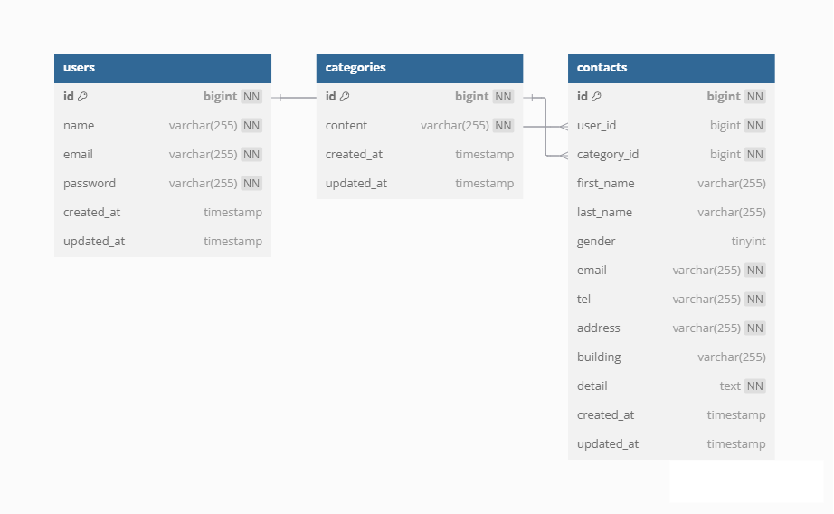

# お問い合わせフォームアプリケーション

## 環境構築手順

```bash
git clone https://github.com/mikaer175-hikaru/check-test.git
cd check-test
cp .env.example .env
docker-compose up -d --build
docker-compose exec php bash
composer install
php artisan key:generate
php artisan migrate --seed

## ER図



## 使用技術（実行環境）

PHP 7.4
Laravel 8.83.8
MySQL 8.0
Docker / docker-compose

## URL

開発環境：http://localhost/
phpMyAdmin:http://localhost8080/